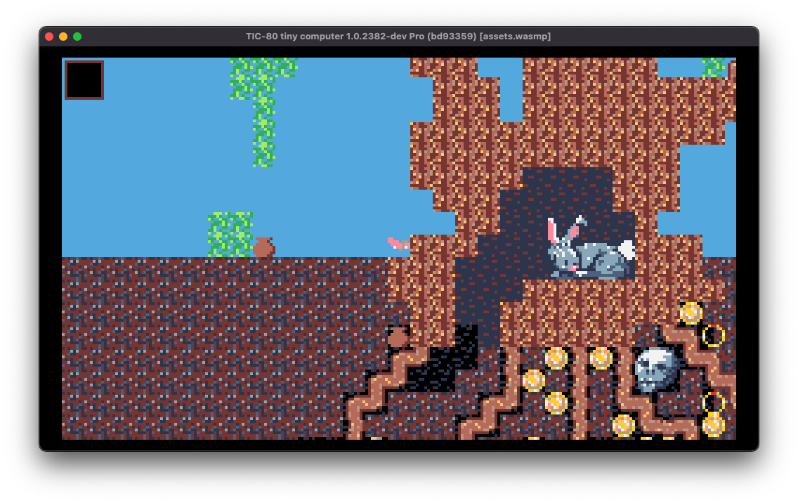
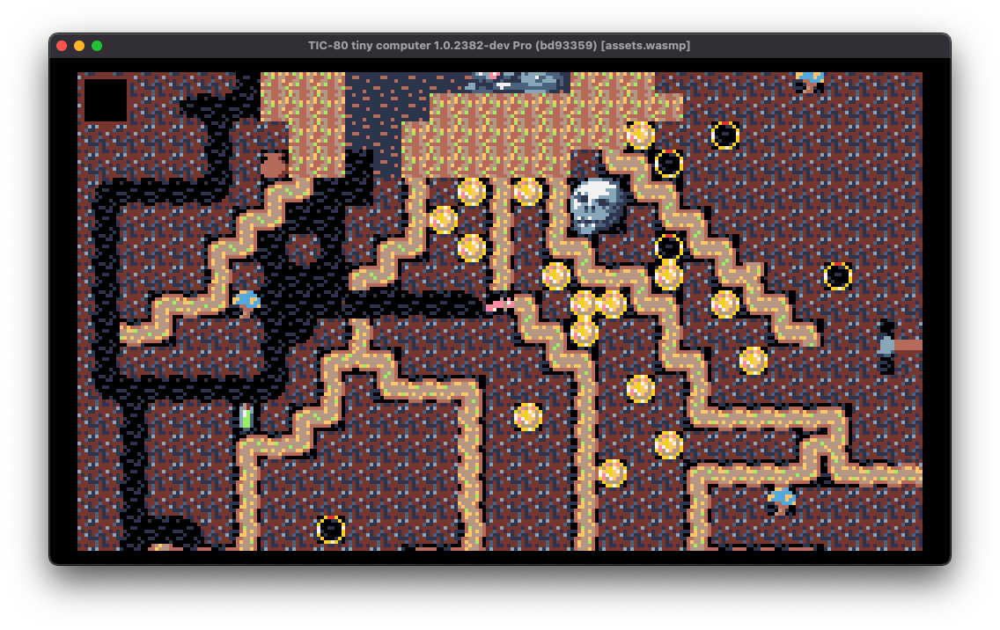
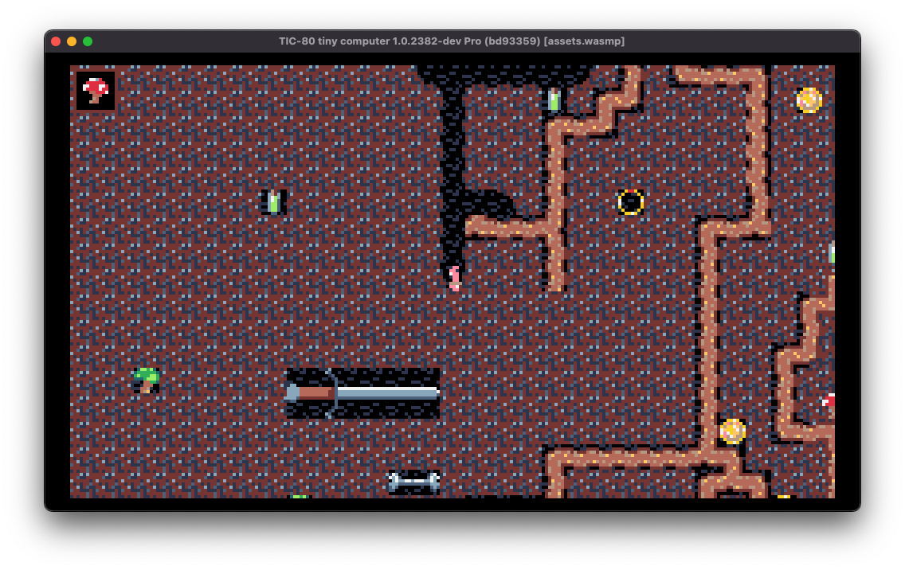

# Global Game Jam 2023

The early bird gets the worm.

_I AM THE WORM_



Your rabbit friend has hurt their leg and needs to hide in the tree to survive. Go see what they need to start feeling better! But be careful not to damage the roots of the tree.

Use the arrow keys to move around, X to dig, and Z to wriggle faster!

**Play it in your browser [here](https://fjebaker.github.io/global-game-jam-2023/)!**

## Screenshots





## Build

Requires:

- Docker runtime to build
- TIC-80 Pro (for WASM support) to run

```bash
make run
```
